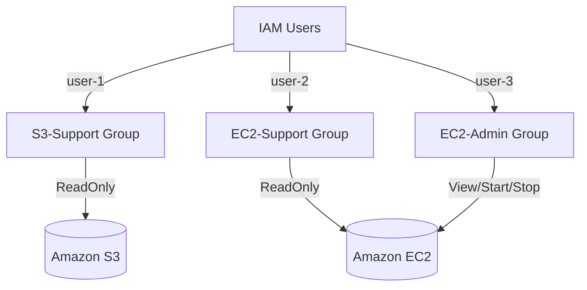

# aws-iam-lab1-essentials
Includes:  S3 bucket creation, IAM user creation / permission setup, AWS CloudShell usage, Uploading or downloading files, Basic EC2 introduction

# AWS IAM Fundamentals – Lab 1 (Coursera AWS Cloud Technical Essentials)

This repository documents my work for **Lab 1** of the *AWS Cloud Technical Essentials* course completed on **Coursera**.  
The lab focuses on **Identity and Access Management (IAM)**—one of the most important AWS security and governance foundations.

This repo includes:
- ✔ Summary of lab objectives  
- ✔ Architecture & IAM permission design  
- ✔ IAM users, groups, and policies  
- ✔ Terraform implementation  
- ✔ CloudFormation implementation  
- ✔ Documentation of tasks performed  
- ✔ IAM sign-in URL usage explanation  

---

# 📚 **Lab Overview**

This lab provisions and explores IAM resources including:

### 👤 IAM Users
- **user-1**
- **user-2**
- **user-3**

### 👥 IAM Groups & Policies
| Group Name      | Permissions                                                                 |
|-----------------|-------------------------------------------------------------------------------|
| S3-Support      | **Read-Only** access to Amazon S3                                            |
| EC2-Support     | **Read-Only** access to Amazon EC2                                           |
| EC2-Admin       | View, Start, and Stop EC2 instances                                          |

---

# 🎯 **Lab Objectives**

After completing the lab, I was able to:

### ✔ Explore IAM Users & Groups
- Review identity objects created in AWS IAM
- Inspect managed policies attached to IAM groups

### ✔ Manage Users & Group Membership
- Assign users to functional groups
- Apply least-privilege security principles

### ✔ Use Real IAM Sign-In URLs
- Retrieve AWS IAM console login URLs
- Log in as each user to test permissions

### ✔ Validate IAM Policies by Logging In
- Test S3 read-only operations  
- Test EC2 read-only operations  
- Test EC2 admin (Start/Stop/View) operations  

---

# 🏢 **Business Scenario**

Your organization is expanding its AWS usage.  
New employees need access based on job role:

| User     | Group        | Permission Goal                                                  |
|----------|--------------|------------------------------------------------------------------|
| user-1   | S3-Support   | Read-Only access to S3                                           |
| user-2   | EC2-Support  | Read-Only access to EC2                                          |
| user-3   | EC2-Admin    | View / Start / Stop EC2 instances                                |

This lab demonstrates **role-based access control (RBAC)** using IAM best practices.

---

# 🗺 **Architecture Diagram**

### Mermaid Version (Render in GitHub Automatically)



---

# 🧪 **Task Summary**

## **Task 1.1 – Explore IAM Users, Groups & Policies**
- Viewed IAM users (user-1, user-2, user-3)
- Explored IAM groups & attached managed policies
- Reviewed JSON IAM policies

## **Task 1.2 – Manage Users and Groups**
- Assigned users to appropriate groups based on job role
- Validated permissions via AWS Console

## **Task 2 – IAM Sign-In URL**
### 🔍 Task 2.1 – Locate IAM Sign-In URL
- Located IAM sign-in URL format:
```
https://<account-alias>.signin.aws.amazon.com/console
```

### 👥 Task 2.2 – Log in as Different IAM Users
- Tested S3 Read-Only (user-1)
- Tested EC2 Read-Only (user-2)
- Tested EC2 Admin Start/Stop/View (user-3)

---

# 🛠 Infrastructure-as-Code (IaC)

This repository includes two IaC implementations representing the IAM configuration:
1. **Terraform**
2. **CloudFormation**

These allow anyone to replicate the lab environment in a real AWS account (free tier eligible).

---

# 📂 Repository Structure

```
aws-iam-lab1-essentials/
│
├── README.md
│
├── architecture/
│   ├── iam-architecture.mmd
│   └── iam-architecture.png
│
├── terraform/
│   ├── main.tf
│   └── variables.tf
│
└── cloudformation/
    └── iam-lab1-template.yaml
```

---

# 🌱 **Skills Demonstrated**

- IAM Users, Groups, and Role-Based Access Control (RBAC)
- AWS IAM Security Best Practices
- IAM Sign-In URL mechanics
- Hands-on IAM policy testing
- Terraform IAM implementation
- CloudFormation IAM implementation
- Architecture diagramming (Mermaid)

---

# 👨‍💻 Author
**Bravo Trevor**  
GitHub: https://github.com/BravoTrevor  
Portfolio: *(your portfolio link)*  

---

# ✔ Ready for Deployment
All Terraform and CloudFormation files in this repository can be deployed in any AWS account.  
This repository serves as a demonstration of IAM fundamentals, security best practices, and infrastructure automation.


